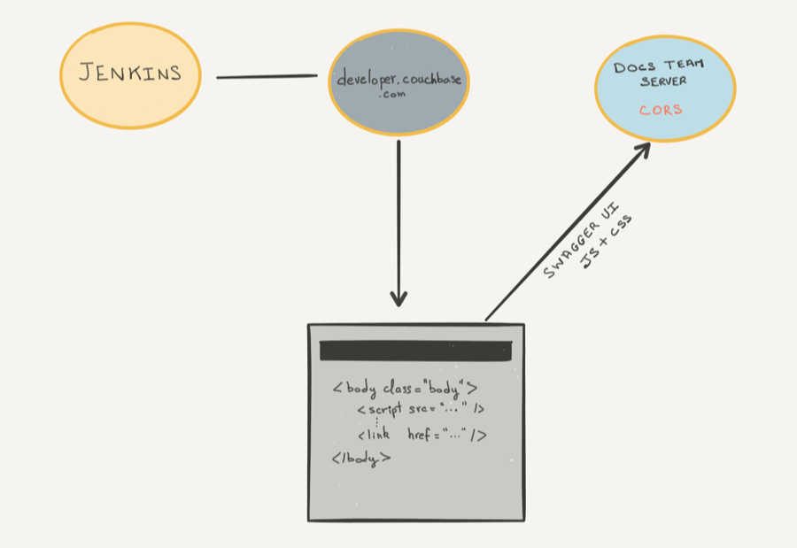

## Getting Started

This repository is the style guide for mobile and server documentation. It's also the repository for common components used in both documentation sets.

### Docs Deployment

Make sure to have the following environment variables set:

- **DOCS_PATH** (path to root of docs repository - [docs-cb4](https://github.com/couchbase/docs-cb4) or [couchbase-mobile-portal](https://github.com/couchbaselabs/couchbase-mobile-portal)).
- **DITA_PATH** (path to root of [dita repository](https://github.com/couchbaselabs/dita-ot-2.1.1))
- **JENKINS_USERNAME** (your username to access the Jenkins server)
- **JENKINS_PASSWORD** (your password to access the Jenkins server)

Then you can run the script with the required parameters.

```bash
./deploy.sh <param1> <param2> <param3> <param4>
```

To deploy the server docs to staging:

```bash
./deploy.sh build server Server IngestStage
```

`param1` is always build. `param2` can be server or mobile. `param3` can be Server or Mobile. `param4` can be IngestStage or IngestQA.

### Examples

Make sure to have the following environment variables set:

- **JENKINS_USERNAME** (your username to access the Jenkins server)
- **JENKINS_PASSWORD** (your password to access the Jenkins server)

#### Article

This example is a simple page to see what the uploaded HTML must adhere to. To publish it to the dev portal, follow the steps below.

```bash
./example.sh article
```

The article is published at [http://developer-qa.cbauthx.com/documentation/mobile/1.3/article/index.html](http://developer-qa.cbauthx.com/documentation/mobile/1.3/article/index.html).

### REST API

In this example, REST APIs are documented using [Swagger](http://swagger.io/). Given a Swagger spec we can publish it on the dev portal using Swagger UI. To publish it to the dev portal, follow the steps below.

```bash
./example.sh rest-api
```

It uploads the content of the **rest-api** folder in this repository. As part of the uploaded content, there are `script` and `link` tags to pull the **SwaggerUI** resources as shown on the diagram below.



The REST API is published at [http://developer-qa.cbauthx.com/documentation/mobile/1.4/swagger-ui.html](http://developer-qa.cbauthx.com/documentation/mobile/1.4/swagger-ui.html).

### Link Verification

While oxygenXML Editor validates links for the files that are being edited, there are times when links used on other pages expire. In this instance we wouldn't find out about the broken link until someone raises a DOC bug and it has already impacted on somebody, this is far from ideal. Therefore, as part of commit validation we have added link verification to ensure that all links work correctly, to do this we use a program called [linkchecker](https://github.com/wummel/linkchecker).

This has already been set up correctly on the documentation jenkins machine (under `/var/lib/jenkins/venv/bin/linkchecker`), but you may also want to set this up on your mac so that you can verify the links locally.
Below are some instructions to set up linkchecker on macOS, these instructions assume that you have [brew package manager](http://brew.sh/) installed:

```
# Create a brew installation of python (if you don't already have one)
brew install python

# Install all of the required SSL modules
pip install urllib3[secure]

# Install a specific version of the 'requests' module to work around a bug
pip install "requests<2.10"

# Install linkchecker
pip install linkchecker
```

Once you have installed `linkchecker` you can then run it against a website to check its links recursively as follows:

```
linkchecker -r <root_index_file> --check-extern
```

This will produce a fairly verbose output, with lots of messages (separate to the errors). The command that is run as part of the commit validation, which has been appropriately tuned, is as follows:

```
PYTHONWARNINGS="ignore:Unverified HTTPS request" linkchecker <root_index_file> --check-extern --ignore-url support.couchbase.com --ignore-url /server/other-products/release-notes-archives/ --no-status
```
