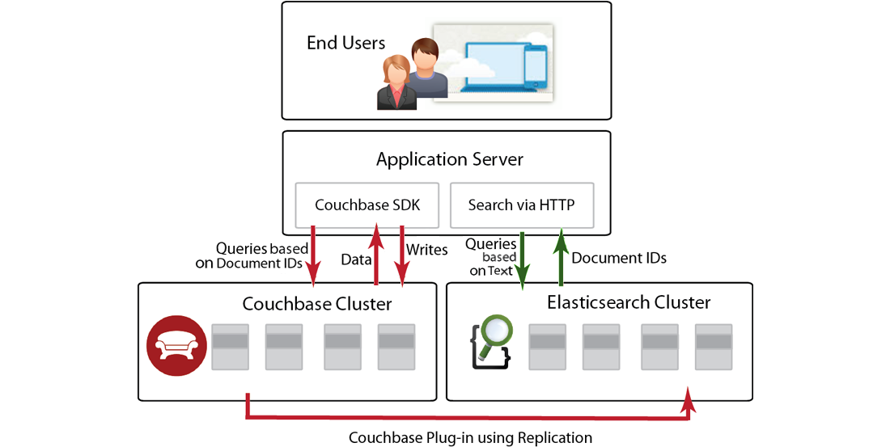

This document explains how to use the Elasticsearch Transport Plugin to coordinate data-searches across Elasticsearch and Couchbase Server. It explains the system architecture, provides step-by-step instructions on installation and configuration; and includes a code-example, whereby the Couchbase SDK can be used in conjunction with the plug-in, to query both repositories.

## Using Elasticsearch and Couchbase

The Elasticsearch Transport Plug-in from Couchbase allows the functionality of Elasticsearch — an open source search-engine — to be combined with that of Couchbase Server; so as to drive the retrieval of more complex document-structures, from Couchbase Server. For example, a product-catalog application that uses Elasticsearch as a repository for product-names may, on successful completion of a name-search, use the search-results to access a corresponding, highly detailed product-description from Couchbase Server.

Conversely, the full text search capability provided by Elasticsearch brings extreme flexibility to the process of identifying and returning critical data-values stored within Couchbase Server.

Couchbase provides a suite of Software Development Kits that you can use, in conjunction with Elasticsearch interfaces, to manage these kinds of data-retrieval.

Note that Elasticsearch clusters can be scaled independently of the Couchbase Server-clusters with which they work: this allows Elasticsearch search-performance to be appropriately resourced; and highly CPU-intensive searches thereby conducted, without any entailed impact on the performance of Couchbase Server reads or writes.

The Elasticsearch Transport Plug-in provides the following:

- Real-time replication: The plug-in transfers all new or modified Couchbase data to the Elasticsearch cluster as soon as the Couchbase Server has written that data to disk. This ensures that the Elasticsearch search-index is always current.
- Topology-awareness: The plug-in handles any node-failures that might occur within either a Couchbase or an Elasticsearch cluster, and so keeps data constantly accessible. Data-replication from a Couchbase cluster always continues from its still-functioning nodes; with the data-items duly sent to Elasticsearch, and thereby made available to be searched on from currently available servers in the Elasticsearch cluster.
- Network-failure recovery: The plug-in is aware both of what data has already been replicated from Couchbase Server, and of what data still needs to be replicated. If a network-failure interrupts data-transfer from a Couchbase Server-cluster, replication resumes for the remaining data, once the network issue is resolved.

The interaction of elements within a Couchbase-Elasticsearch data-replication system is represented by the following illustration:

As the illustration shows, the Couchbase Server-cluster constantly replicates its data to the Elasticsearch Cluster, ensuring that the Elasticsearch Cluster is fully up-to-date. The plug-in transmits the data by means of a protocol understood by Elasticsearch. On receipt of the data, the Elasticsearch cluster performs indexing based on the data provided by Couchbase Server. (Not all the Couchbase data need be indexed within Elasticsearch: if appropriate, a subset of fields or of documents can be specified for indexing.)

Code within an Application Server uses Elasticsearch queries to make text-based searches across its available data. When such a search is conducted on an index that is based on a bucket replicated from the Couchbase Server-cluster, the application can retrieve the document ID for each returned value, and pass this to Couchbase Server, by means of a call defined by the Couchbase SDK. A corresponding document is returned for each ID.